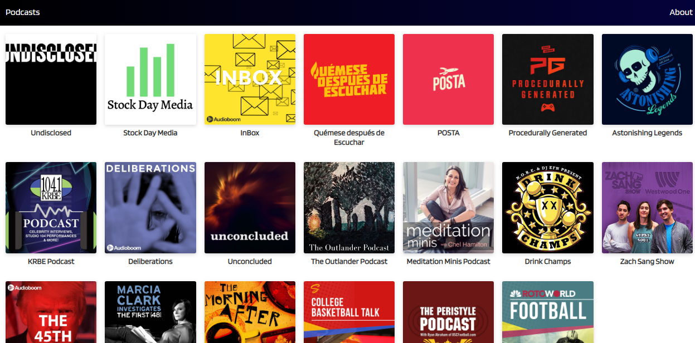

# App de Podcasts

App de Podcasts integrada con la API de Audioboom, implementada con Next.js.

[Ver la app]()

## ¿Cómo funciona?

Requiere Node.js 10

* `npm install` para instalar dependencias.
* `npm run dev` para entorno de desarrollo.
* `npm run build && npm run start` para entorno de producción.

## Licencia

MIT